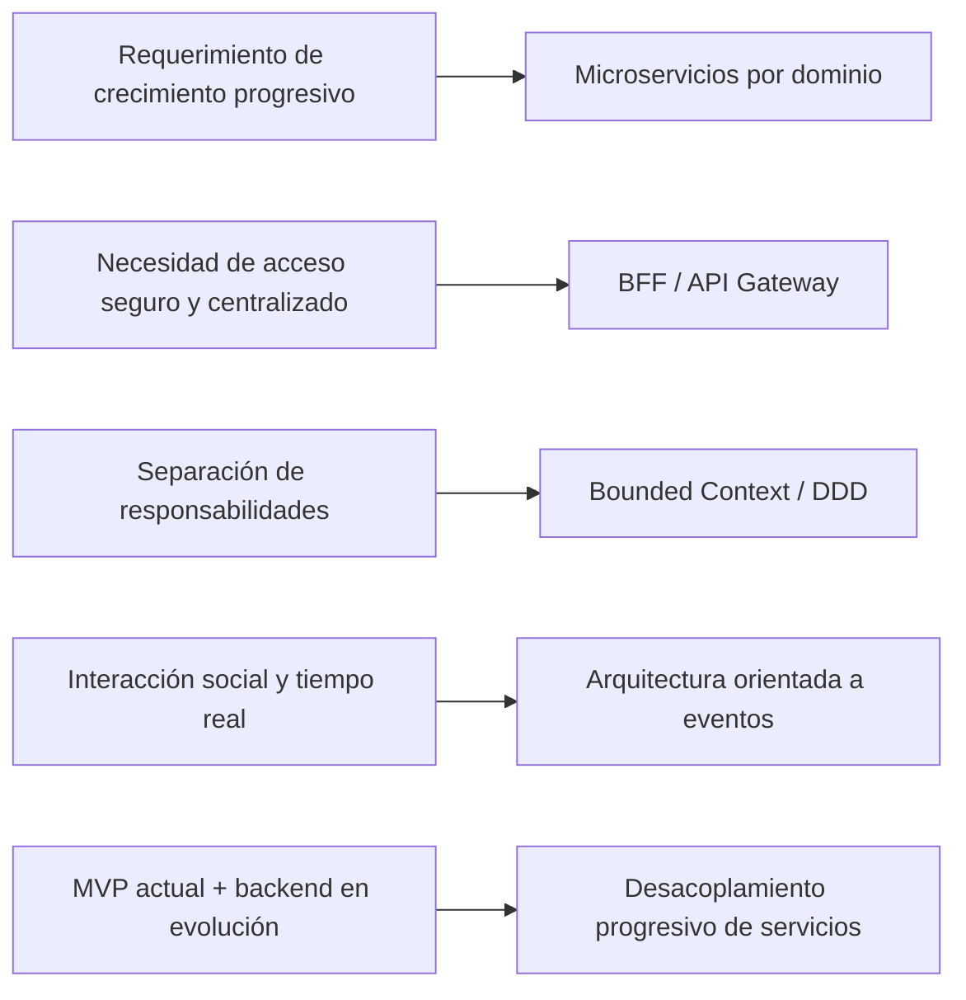
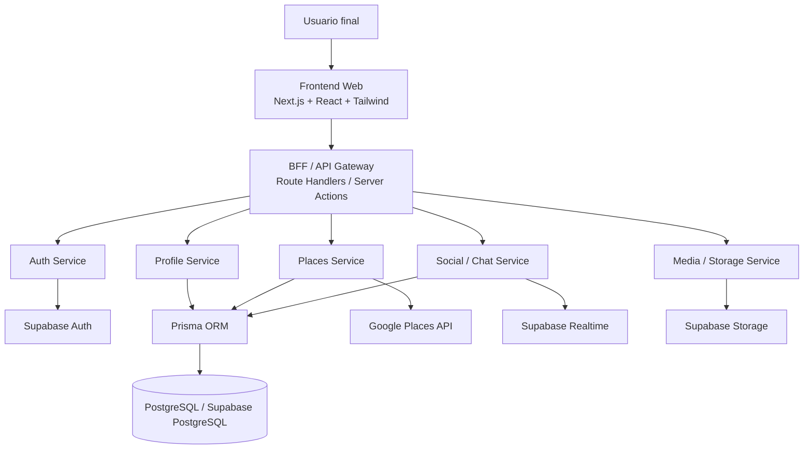

# INFORME TÉCNICO — PROPUESTA DE ARQUITECTURA DE MICROSERVICIOS PARA `eMeet`

**Proyecto:** `eMeet`  
**Fecha:** Abril 2026  
**Tipo de documento:** Informe técnico de arquitectura

---

## 1. Selección de patrones de arquitectura según el caso presentado

### 1.1 Contexto del caso

`eMeet` es una plataforma web orientada al descubrimiento de panoramas cercanos, como bares, cafés, restaurantes y discotecas, de acuerdo con la ubicación del usuario, sus preferencias y su intención de socializar. Actualmente, el proyecto ya cuenta con un **frontend MVP funcional** desarrollado en `Next.js`, mientras que el backend real se encuentra en etapa de diseño e implementación progresiva.

A partir de los requerimientos del cliente, la solución debe cubrir:

- registro e inicio de sesión;
- descubrimiento de lugares cercanos;
- filtros por distancia y tipo de lugar;
- gestión de perfil y preferencias;
- guardado de favoritos e interacciones;
- comunidad/chat asociado a lugares;
- posibilidad de escalar a promociones, beneficios o QR.

Además, debe responder a requerimientos no funcionales como **escalabilidad**, **seguridad**, **mantenibilidad**, **privacidad** y **sostenibilidad técnica**.

### 1.2 Esquema de selección de patrones

### 1.3 Patrones seleccionados y justificación

| Patrón | Aplicación en `eMeet` | Justificación técnica |
|---|---|---|
| **Microservicios por dominio** | Separación de `Auth`, `Profile`, `Places`, `Social/Chat` y `Media` | Permite evolucionar y escalar cada capacidad del sistema sin afectar toda la solución |
| **BFF / API Gateway** | Capa intermedia con `Next.js Route Handlers` o `Server Actions` | Evita exponer claves, centraliza validaciones y simplifica el consumo desde frontend |
| **Bounded Context (DDD)** | Delimitación clara de responsabilidades por dominio | Mejora mantenibilidad y reduce acoplamiento entre módulos |
| **Arquitectura orientada a eventos** | Realtime, notificaciones y actividad social | Facilita sincronización en comunidad/chat y futuras alertas |
| **Servicios desacoplados** | Evolución modular del producto | Permite agregar promociones, QR o analítica sin rediseñar el sistema completo |

### 1.4 Justificación general de la selección

La selección de estos patrones se considera adecuada porque el proyecto ya validó la experiencia principal del producto desde el frontend, pero requiere una base backend escalable para sostener la evolución funcional. Un enfoque monolítico rígido podría funcionar en una fase inicial, pero dificultaría la separación de autenticación, preferencias, interacciones sociales y futuras integraciones.

Por ello, se propone una arquitectura basada en **microservicios lógicos por dominio**, coordinados por una capa **BFF/API Gateway**, que permite responder de manera coherente a los requerimientos del cliente y a las necesidades de crecimiento del sistema.

---

## 2. Herramientas y estrategias para la implementación de los microservicios

### 2.1 Herramientas seleccionadas

| Herramienta / tecnología | Rol dentro de la solución | Aporte a la eficiencia técnica y operativa |
|---|---|---|
| **Next.js 14** | Frontend y capa BFF | Permite mantener una sola base tecnológica para interfaz y orquestación segura |
| **TypeScript** | Tipado del frontend y backend | Reduce errores y mejora mantenibilidad del código |
| **Supabase Auth** | Registro, login y control de sesiones | Acelera la implementación de autenticación segura sin construirla desde cero |
| **Supabase PostgreSQL** | Persistencia principal | Proporciona estructura relacional sólida para perfiles, preferencias, interacciones y chat |
| **Prisma ORM** | Modelado y acceso a datos | Mejora legibilidad, control de migraciones y coherencia del backend |
| **Supabase Realtime** | Actualización en tiempo real para chat/comunidad | Aporta inmediatez en la experiencia social sin infraestructura extra compleja |
| **Supabase Storage** | Archivos e imágenes | Centraliza recursos multimedia del sistema |
| **Google Places API** | Servicio externo de lugares cercanos | Permite consultar panoramas reales sin crear un catálogo propio inicial |
| **GitHub** | Control de versiones y colaboración | Ordena el trabajo del equipo y facilita trazabilidad |
| **Docker** *(opcional)* | Estandarización de entorno y despliegue | Útil para etapas futuras, pero no obligatorio en la fase actual del proyecto |

### 2.2 Estrategias propuestas de implementación

Se proponen las siguientes estrategias:

1. **Implementación incremental por capas**  
   Primero se reemplazan los módulos mock críticos (`auth`, `saved`, `chat`) por servicios reales, evitando rehacer el frontend existente.

2. **Separación por dominios funcionales**  
   Cada servicio resuelve una capacidad concreta: autenticación, perfil, lugares, interacción social y archivos.

3. **Centralización de servicios externos en backend**  
   La consulta a `Google Places API` no debe quedar como dependencia final del cliente, sino ser gestionada por el backend / BFF para proteger credenciales y controlar consumo.

4. **Persistencia progresiva**  
   Se prioriza guardar perfil, preferencias, likes, favoritos y salas de chat, porque son los elementos ya reflejados en el frontend actual.

5. **Escalado sin sobrediseño**  
   Se evita construir una infraestructura excesiva en esta etapa; se adopta una solución realista, escalable y académicamente justificable.

Estas estrategias aportan eficiencia porque permiten aprovechar el trabajo ya realizado en el MVP, reducen retrabajo, facilitan el mantenimiento y disminuyen complejidad operativa innecesaria.

---

## 3. Diagrama de arquitectura de microservicios propuesta

### 3.1 Descripción breve de los servicios

| Servicio | Función principal |
|---|---|
| **Auth Service** | Registro, inicio de sesión, sesiones y control de acceso |
| **Profile Service** | Gestión de perfil, intereses y preferencias del usuario |
| **Places Service** | Consulta de lugares cercanos, normalización y filtrado de resultados |
| **Social / Chat Service** | Comunidades, salas y mensajería asociada a lugares |
| **Media / Storage Service** | Gestión de imágenes, avatares y archivos futuros |

La arquitectura representada es coherente con el estado actual del proyecto porque reutiliza el frontend ya construido y propone una evolución backend modular y segura.

---

## 4. Seguridad, privacidad y sostenibilidad en la arquitectura propuesta

### 4.1 Seguridad

La seguridad se considera un eje transversal del diseño. Para ello se propone:

- autenticación centralizada mediante **Supabase Auth**;
- uso de **HTTPS** en todas las comunicaciones;
- protección de tablas mediante **RLS (Row Level Security)**;
- validación de entradas y control de acceso desde la capa BFF;
- resguardo de claves sensibles del lado servidor, especialmente para servicios externos.

### 4.2 Privacidad

Dado que la plataforma utiliza datos personales y de ubicación, la arquitectura contempla:

- mínima recopilación de datos necesarios;
- consentimiento para el uso de geolocalización;
- restricción de acceso a información sensible por usuario autenticado;
- separación entre datos de identidad, preferencias e interacciones;
- posibilidad de eliminación o anonimización en futuras etapas.

### 4.3 Sostenibilidad

La propuesta también incorpora sostenibilidad técnica y operativa:

- uso de servicios gestionados para evitar infraestructura sobredimensionada;
- centralización de consultas externas para optimizar costos y consumo;
- escalado progresivo según el crecimiento real del sistema;
- reutilización del frontend actual para reducir retrabajo y tiempo de implementación.

En conjunto, estas medidas permiten una solución más responsable, mantenible y realista para el contexto del proyecto.

---

## 5. Evaluación general del diseño propuesto frente a los requerimientos del cliente y especificaciones técnicas

### 5.1 Evaluación por criterio

| Requerimiento / criterio técnico | Respuesta del diseño propuesto | Evaluación |
|---|---|---|
| Registro e inicio de sesión | `Auth Service` + `Supabase Auth` | ✅ Cumple |
| Descubrimiento de lugares cercanos | `Places Service` + consulta externa centralizada | ✅ Cumple |
| Filtros por preferencias y distancia | `Profile Service` + persistencia en PostgreSQL | ✅ Cumple |
| Favoritos e interacciones | Registro de `like`, `save` y descartes en backend | ✅ Cumple |
| Comunidad y chat | `Social / Chat Service` + `Supabase Realtime` | ✅ Cumple |
| Seguridad y privacidad | BFF, RLS, control de sesiones y resguardo de claves | ✅ Cumple |
| Escalabilidad y mantenibilidad | Microservicios lógicos por dominio | ✅ Cumple |

### 5.2 Fortalezas principales del diseño

- aprovecha el MVP frontend ya desarrollado;
- propone una evolución realista y progresiva del backend;
- reduce exposición de credenciales al mover servicios externos a la capa servidor;
- mantiene coherencia entre arquitectura, requerimientos y tecnologías seleccionadas;
- deja abierta la posibilidad de crecimiento hacia nuevas funciones comerciales.

### 5.3 Riesgos o desafíos a considerar

- dependencia de servicios externos como `Google Places API`;
- necesidad de controlar consumo y costos en el backend;
- transición ordenada desde lógica mock a persistencia real;
- necesidad de reforzar pruebas, monitoreo y documentación en etapas posteriores.

### 5.4 Evaluación final

En términos generales, la propuesta es **favorable** y técnicamente consistente con el estado actual del proyecto. La arquitectura planteada no intenta reemplazar el trabajo ya realizado, sino complementarlo con una capa backend segura, escalable y mantenible. Esto permite responder a las necesidades del cliente con una solución moderna, modular y alineada con buenas prácticas de diseño de software.

---

## 6. Conclusión

Se concluye que la mejor alternativa para `eMeet` es una arquitectura basada en **microservicios lógicos por dominio**, coordinada por una capa **BFF / API Gateway** en `Next.js`, con soporte de `Supabase` y `Prisma` para autenticación, persistencia, tiempo real y almacenamiento.

Esta propuesta responde de forma adecuada a los requerimientos funcionales y no funcionales del cliente, al tiempo que se ajusta al estado real del proyecto: un frontend MVP ya operativo y un backend en etapa de consolidación progresiva.

---

## 7. Recomendaciones para la siguiente etapa

1. reemplazar la autenticación mock por `Supabase Auth`;  
2. persistir perfil, preferencias, guardados e interacciones;  
3. mover completamente la consulta de lugares al backend / BFF;  
4. integrar chat persistente con `Supabase Realtime`;  
5. documentar contratos, endpoints y reglas de acceso del sistema.
