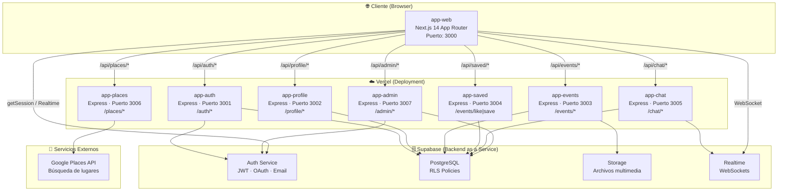

# Diagrama de Arquitectura de Microservicios — eMeet

## Visión General

eMeet es una plataforma de descubrimiento de eventos sociales construida sobre una arquitectura de microservicios. El sistema separa responsabilidades en servicios independientes que se comunican a través de HTTP REST.

## Diagrama de Arquitectura



## Descripción de Componentes

### Frontend — app-web (Next.js 14)
- **Tecnología**: React 18, Next.js 14 App Router, TypeScript, Tailwind CSS, Framer Motion
- **Responsabilidad**: Interfaz de usuario completa. Actúa como BFF (Backend for Frontend) proxy hacia los microservicios a través de sus rutas `/api/*`
- **Autenticación**: Gestiona la sesión Supabase en el cliente. El token JWT se adjunta automáticamente en cada petición a los microservicios
- **Mapas**: Integra Google Maps JavaScript API y Google Places API (nueva versión)

### Microservicios Backend (Express + TypeScript)

| Servicio | Puerto | Responsabilidad |
|----------|--------|-----------------|
| app-auth | 3001 | Login, registro, OAuth, sesiones |
| app-profile | 3002 | Perfil de usuario, bio, avatar, intereses |
| app-events | 3003 | CRUD de eventos, upload multimedia a Supabase Storage |
| app-saved | 3004 | Likes, guardados, recomendaciones personalizadas |
| app-chat | 3005 | Salas de chat por evento, mensajes, miembros, leídos |
| app-places | 3006 | Proxy hacia Google Places API (búsqueda, detalles, fotos) |
| app-admin | 3007 | Gestión de usuarios, eventos y estadísticas globales |

### Capa de Datos — Supabase

| Componente | Uso |
|------------|-----|
| Auth | JWT tokens, OAuth con Google, gestión de usuarios |
| PostgreSQL | Base de datos relacional principal con RLS |
| Storage | Almacenamiento de imágenes y videos de eventos |
| Realtime | WebSockets para mensajes de chat en tiempo real |

## Flujo de Autenticación

```
1. Usuario ingresa credenciales
2. app-web → POST /api/auth/login (proxy Next.js)
3. → app-auth → Supabase Auth (signInWithPassword)
4. ← Supabase devuelve {access_token, refresh_token}
5. ← app-auth devuelve tokens al frontend
6. app-web: supabase.auth.setSession(tokens)
7. Token JWT se incluye en Authorization header en cada request
8. Cada microservicio valida el JWT con withAuth middleware (Supabase)
```

## Patrones de Comunicación

- **Sync HTTP/REST**: Toda comunicación entre frontend y microservicios
- **WebSockets**: Chat en tiempo real vía Supabase Realtime (cliente ↔ Supabase directo)
- **Proxy BFF**: Next.js actúa como reverse proxy para evitar CORS y centralizar auth
- **Service Role**: Los microservicios usan `SUPABASE_SERVICE_ROLE_KEY` para operaciones administrativas (bypassear RLS cuando es necesario)
